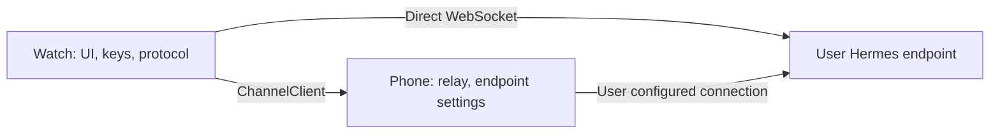

# Architecture

## Verified sources

SDK `v0.2.0` resolves to commit `323e3303ab68981f810fc3208119cd8a22e64af0`. Read in full: [protocol](https://github.com/Adolanium/hermes-gadget-sdk/blob/323e3303ab68981f810fc3208119cd8a22e64af0/docs/protocol.md), [Hermes integration](https://github.com/Adolanium/hermes-gadget-sdk/blob/323e3303ab68981f810fc3208119cd8a22e64af0/docs/hermes-integration.md), architecture, porting, faces, and tailscale-funnel in the same snapshot. Also reviewed the Linux client, simulator transport/conversation, devserver, Python protocol helpers/tests, firmware vectors, and hub handshake/audio routes. Pet evidence is pinned separately in [pets](pets.md).

Corrections to the brief: `linux/client.py` now hosts the native C++ core through `NativeDevice`; it is not an independent pure-protocol client. Kotlin will implement the documented wire contract, using the Python protocol helpers and firmware vectors as the oracle. The stock adapter can auto-confirm a deliberate `session.new` within its confirmation window. Streaming `reply.delta.text` is cumulative.

## Modules and boundaries

| Module | Responsibility | Restrictions |
| --- | --- | --- |
| `protocol` | Identity/HMAC, binary framing, JSON envelopes, handshake, heartbeat and negotiation | Pure Kotlin/JVM; no Android; no logs of keys or frames |
| `wear` | Compose for Wear OS, direct socket, Keystore, audio, state/rendering/actions, later surfaces | Owns endpoint device keys and protocol authentication |
| `mobile` | Compose onboarding, endpoint configuration, later relay and BYOK vault | No automatic upload of keys, recordings, or diagnostics |
| `server` | Index of proposed upstream patch series | No replacement stock server or hidden private fork |
| `tools` | Pinned upstream setup and devserver integration helpers, later companion-sheet tooling | Private runtime files under ignored `.local` |

Both Android artifacts use application ID `dev.quantumink.hermesgadget` and must share a signing certificate for the Data Layer; namespaces distinguish watch and phone code. Watch minimum API 33 (Wear OS 4), phone minimum API 29, compile/target API 37. The [current Play policy](https://developer.android.com/google/play/requirements/target-sdk) requires API 36 for phone submissions and at least API 35 for Wear submissions; re-check at M8. No release signing credentials are committed. Starter apps declare themselves dependent until usable standalone transport exists.

## Protocol and state ownership

An endpoint identity is 32 random bytes, encrypted at rest with a non-exportable Keystore AES-GCM key. Derive `hg-` plus the first 16 lowercase hex characters of SHA-256. First contact sends the Base64 key; enrolled contact sends the HMAC over the literal nonce string. A protocol session is confined to one ordered event stream. Reconnect creates a fresh handshake and discards stale transport callbacks; endpoint switching never shares identity material.

One WebSocket offers `hermes-gadget.v1`. JSON envelopes require a string `type`; known fields are validated and unknown types/fields ignored. Binary frames contain channel, stream, and little-endian wrapping sequence. Stock channels are audio, RGB565 image, and firmware. Optional asset channel 4 is accepted only after extension support is established. Bounds apply before allocating media buffers. An Android app never advertises firmware OTA.

`hello -> challenge -> auth -> welcome` precedes conversation input. `welcome.paired`, `paired`, and `unpaired` control authorization UI. Heartbeat timestamps are echoed; any inbound frame refreshes liveness; three heartbeat intervals without traffic closes the connection. Handshake timeout and exponential backoff are separate from conversation idle disconnect. Backoff resets after a healthy session, never merely TCP open. Prompt guards use monotonic time.

Audio starts as mono PCM16 at 16 kHz, approximately 256 kbit/s of payload per direction. Use AudioRecord/AudioTrack off the main thread, bounded recording and playback buffers, stream/sequence checks, and immediate cancellation. Server pacing is at most 0.5 seconds ahead; allow approximately one second of playback buffering. Stock mic rates are constrained to 4–48 kHz in hub code, rather than arbitrary rates. Missing format selection means PCM16. Future Opus support must inspect MediaCodec availability and codec-specific headers; do not assume raw packets equal Ogg output from a provider.

## Transports and relay trust

The diagram describes reachability, not an encryption guarantee. Stock TOFU sends the key in `auth`; a phone that terminates the watch/server WebSockets sees it. HMAC proves key possession to the server but does not sign conversation frames or authenticate the server to the watch. Therefore keeping key storage on the watch alone does not meet the brief's compromised-phone requirement.

Recommended M3 approach: ChannelClient carries an opaque bidirectional byte stream; the phone forwards TCP bytes, while the watch owns TLS and WebSocket framing end to end. Normal certificate/hostname validation is required. The phone then cannot read enrollment or forge protocol traffic, but can still drop traffic and observe timing. This requires a TLS endpoint reachable by the phone and an Android stream/TLS adapter validated on hardware. A stock cleartext-only endpoint would need server TLS configured or an explicitly accepted trusted-phone threat model. User choice is pending; no relay implementation depends on an assumed answer.

The phone's Tailscale Android app provides the VPN; no Tailscale embedding is planned for v1. A later `tsnet`/gomobile investigation must cover tailnet authentication, state/key storage, mobile VPN coexistence, battery, binary size, and the exact pinned component licenses before adoption. We do not assume one license covers Tailscale client components, SDK integration, and hosted service terms.

Auto selection prefers a reachable paired phone relay, otherwise a configured direct endpoint; a manual override is visible. Transport handoff must close the old authenticated session before opening another, prevent replay of recorded audio or answered prompts, and never fall back to weaker TLS settings silently.

## Network policy decision

Target API 37 also introduces local-network permission enforcement on Android 17. Before M2 LAN connections, implement and test the applicable runtime permission/rationale flow; do not mistake a denied local-network permission for a TLS or pairing error. See [Android local-network protection](https://developer.android.com/privacy-and-security/local-network-permission).

[Android network security configuration](https://developer.android.com/privacy-and-security/security-config) declares static base/domain rules; arbitrary endpoint names cannot be added to packaged XML at runtime. M0 ships `cleartextTrafficPermitted=false`. M2 cleartext support is a **DECISION**: use a release-wide platform allowance plus an audited per-endpoint application gate, or require TLS. A permitted cleartext endpoint must be explicitly labeled LAN/tailnet with a warning; public endpoints always require `wss`. Do not infer private safety from a hostname or merely from an IP range. Disable cross-origin redirects, embedded URL credentials, and secret-bearing query parameters; never log configured addresses.

## Upstream extensions

See [upstream](upstream.md). Opus negotiation, client TTS, pet delivery, and reconnect outbox are independent optional proposals. Each needs plugin code, protocol documentation, feature-off compatibility tests, and stock gadget tests on a clean branch against the pinned SDK. Unknown optional fields do not change protocol v1. No extension is advertised as implemented today.

Pet PNG assets need explicit length/hash metadata, dimensions and row occupancy, bounded chunking, completion/abort semantics, cache quota, and no client-supplied filesystem paths. Profile multiplexing additionally needs per-profile authorization/storage and gateway registration hooks; it is not implemented based on unit-test-only profile behavior.

## Validation strategy

CI builds both debug apps, runs JVM and Android host unit tests, Android lint with warnings treated as errors, ktlint, and gitleaks. Gradle warning mode and Kotlin warnings fail the build. The wrapper distribution and CI actions are pinned. JVM integration starts the actual SDK devserver in an isolated temp directory, enrolls, approves a synthetic device, reconnects with HMAC, and verifies an echo conversation and PCM loopback. Network/runtime details are ephemeral and omitted from committed reports.

Hardware checks remain separate: Ultra mic/playback, round clipping, prompt accidental-press prevention, Bluetooth relay loss/backpressure, VPN reachability from the phone, Opus bitrate/STT, standby battery, ambient burn-in, and signed Play internal-track installation.
