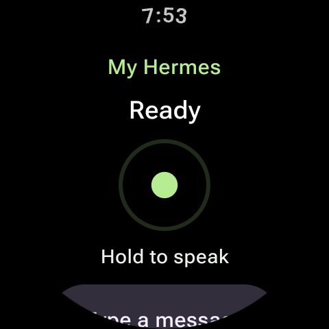
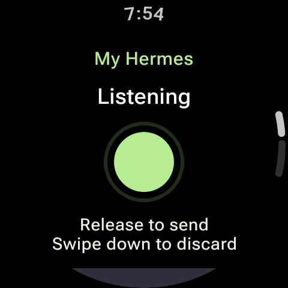
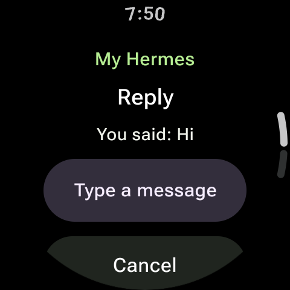
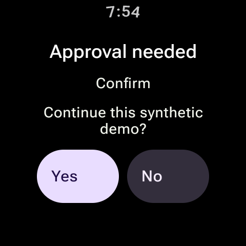
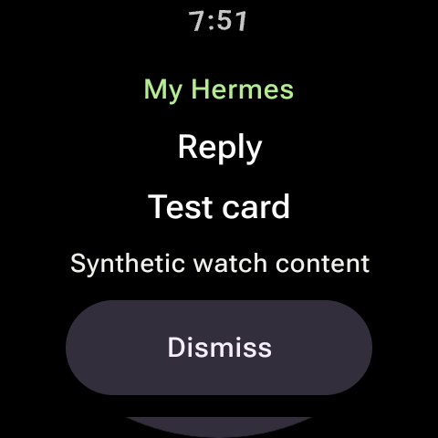
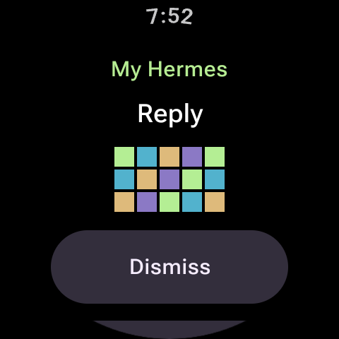

# M2 synthetic watch demo

Captured on 2026-10-05 from the app running on a round 480×480 Wear OS 7 / API 37 ARM64 emulator. All server content, enrollment, and art are synthetic. Host microphone input and host audio were disabled. These are emulator screenshots, not physical-watch or real-Hermes evidence. Capture hashes are in [manifest.json](manifest.json).

| Ready | Listening | Typed reply |
| --- | --- | --- |
|  |  |  |

| Approval | Card | RGB565 image |
| --- | --- | --- |
|  |  |  |

[Setup](setup.png) and [synthetic pairing](pairing.png) are also recorded. Both approval choices fit together within the round screen. Longer replies/questions scroll.

Demonstrated through the app: configure a synthetic loopback endpoint with explicit LAN declaration and warning acceptance; grant local-network access; pair with the stock SDK; enter `Hi` using Wear's keyboard and receive `You said: Hi`; grant microphone permission without starting capture until a fresh hold; hold/release PCM capture and receive an emulated-input loopback; swipe down to discard; display and answer yes/no prompts; display cards/images; hold Cancel for two seconds to start a new conversation; reconnect with the saved identity.

The SDK received successful results from Android vibration, app-window brightness, and notification actions. Notification denial omitted that action from the initial manifest; granting it on reconnect added it. This image has no system clock activity handling `ACTION_SET_TIMER`, so `timer.start` was correctly omitted. Timer bounds/errors pass JVM tests; executing a real clock timer remains a hardware check. No physical vibration sensation, speaker quality, STT quality, or battery result is claimed.

The three Keystore instrumentation tests validate persistence, separate endpoint identities, encrypted records, a non-exportable key, tamper failure, and explicit recovery from missing records/keys. The opt-in setup UI test validates draft preservation across an activity stop/return and both cleartext gates. It accepts only a synthetic localhost devserver argument and refuses to replace existing saved setup.

To reproduce the storage tests on a connected test watch/emulator:

```bash
./gradlew :wear:assembleDebug :wear:assembleDebugAndroidTest
adb install -r wear/build/outputs/apk/debug/wear-debug.apk
adb install -r wear/build/outputs/apk/androidTest/debug/wear-debug-androidTest.apk
adb shell am instrument -w -r -e class dev.quantumink.hermesgadget.wear.IdentityVaultTest dev.quantumink.hermesgadget.test/androidx.test.runner.AndroidJUnitRunner
```

For the opt-in UI test, use a fresh test emulator, run `tools/integration_devserver.py --ready-file .local/ready.json` with the pinned Python environment, reverse its ephemeral port with `adb reverse`, and pass `-e syntheticEndpoint` with the synthetic localhost WebSocket URL to `WatchSetupTest`. The default instrumentation run skips that opt-in UI test without the argument. Never pass a personal endpoint to it.

The `WatchDraftTest` opt-in regression uses the same isolated fixture and a fresh emulator setup. Approve its synthetic enrollment in the devserver console. It verifies that a draft survives disconnect/reconnect, Send is disabled offline, reconnect does not replay it, and a fresh Send receives the echo reply. Run it separately from identity-reset tests. The setup and draft tests refuse existing saved setup. Never run identity-reset tests on a personal watch.

Physical pairing, saved-identity reconnect, updated APK installation, and a typed round trip to the real Hermes gateway passed on the Galaxy Watch Ultra on 2026-10-06; see [progress](../../progress.md). Those captures remain private. Primary acceptance still requires physical permission-denied behavior, actual mic/speaker quality, timer execution, remaining media/actions, screen gestures, and background/idle checks.
