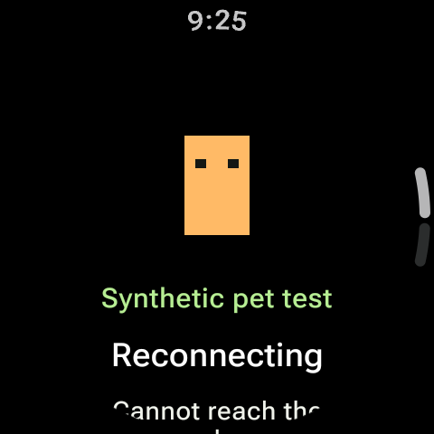

# M5 synthetic pet demo

Owned 480×480 API 37 Wear emulator. The rectangular robot is original synthetic
art generated in the isolated devserver, not Hermes or personal pet art. This
capture shows cached rendering while reconnecting after the fixture stopped;
text below the viewport is scrollable. It does not prove physical-watch legibility.

`WatchPetTest` received the asset through the actual patched SDK and GadgetService,
verified six idle/four waving frames at 96×104 prepared pixels, restored the private
cache, rejected another endpoint's cache, and retained the pet after disconnect.
`PetCacheTest` verified hash/dimensions/alpha/corruption and blank-tail trimming.
See [pet contract and tooling](../../pets.md) and [progress](../../progress.md).
